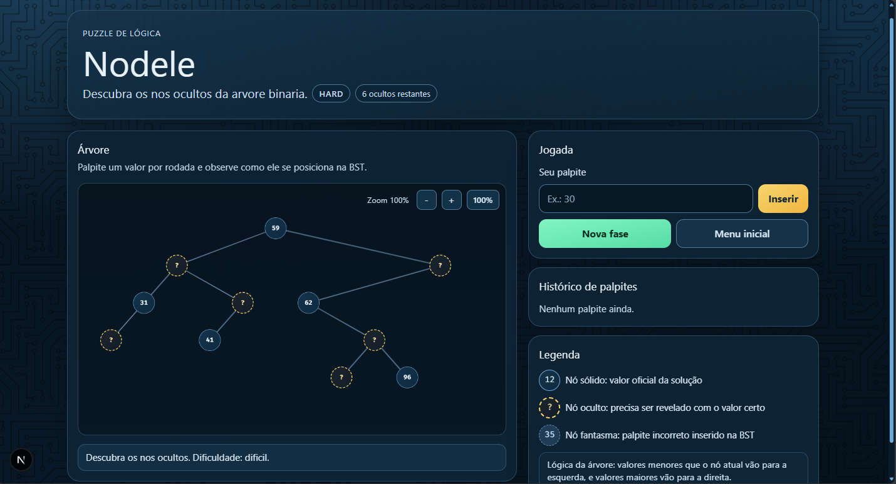

# Nodele

Nodele é um jogo de lógica com foco em árvore binária de busca. O objetivo é descobrir os nós ocultos da árvore por meio de palpites, observando como cada valor se posiciona à esquerda ou à direita de acordo com a regra da BST.



## Como funciona

- Cada fase gera uma árvore binária com alguns nós ocultos.
- Ao digitar um valor, o jogo verifica se ele corresponde a um nó oculto.
- Valores menores que o nó atual seguem para a esquerda.
- Valores maiores que o nó atual seguem para a direita.
- Palpites errados entram como nós fantasmas para mostrar o caminho percorrido.

## Recursos

- Três níveis de dificuldade.
- Histórico de palpites.
- Visualização da árvore com zoom.
- Interface responsiva com visual personalizado.
- Legenda explicando os tipos de nós e a lógica da árvore.

## Tecnologias

- Next.js 16
- React 19
- TypeScript
- Tailwind CSS v4

## Executando o projeto

### Pré-requisitos

- Node.js instalado
- npm instalado

### Instalação

```bash
npm install
```

### Desenvolvimento

```bash
npm run dev
```

Abra [http://localhost:3000](http://localhost:3000) no navegador.

### Build de produção

```bash
npm run build
```

### Iniciar versão de produção

```bash
npm run start
```

### Lint

```bash
npm run lint
```

## Estrutura principal

- `app/` - layout global e página inicial
- `components/` - interface do jogo
- `lib/` - lógica da árvore, fases e estado do jogo
- `public/` - imagens e assets estáticos

## Licença

Projeto pessoal para estudo e experimentação com árvores binárias e interface de jogo.
